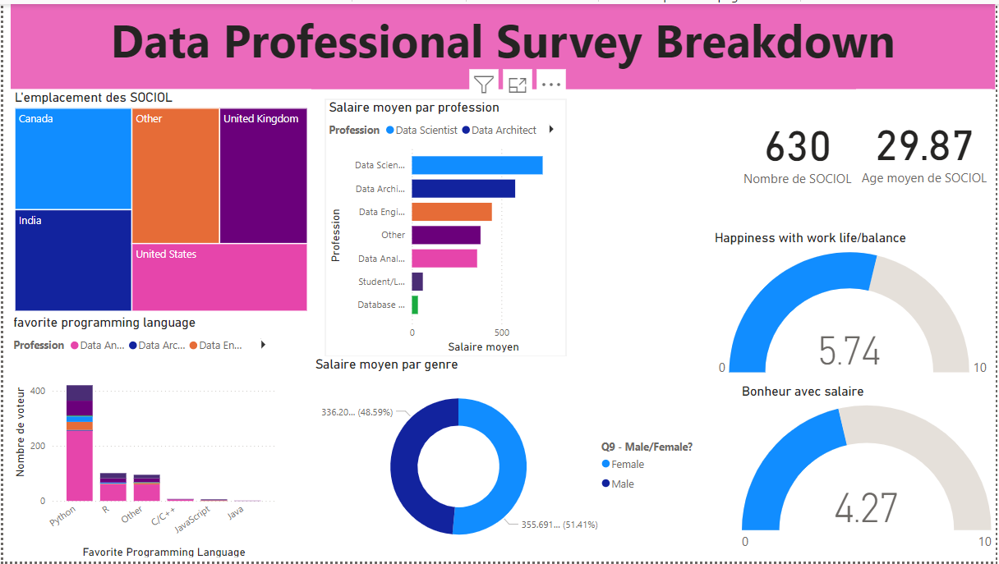

# Data-Professionals-Survey-Dashboard

## 📝 Description
Ce projet présente un tableau de bord interactif basé sur une enquête menée auprès des professionnels travaillant dans le domaine de la data.  
Il analyse des aspects tels que :
- **Salaire** : Comparaison des salaires selon les professions et le genre.
- **Langages de programmation** : Analyse des langages les plus utilisés.
- **Équilibre vie professionnelle/vie personnelle** et **Satisfaction salariale**.
- **Répartition géographique** : Emplacement des répondants.

---

## 📊 Aperçu du tableau de bord


---
## 🛠️ Préparation et Nettoyage des Données

### 1. **Source des données**
Les données proviennent d'une enquête réalisée auprès de professionnels du secteur de la data. Elles contiennent des informations sur :
- Profession,
- Salaire,
- Langage de programmation préféré,
- Genre,
- Âge,
- Localisation géographique,
- Satisfaction personnelle.

### 2. **Nettoyage des données**
- **Outils utilisés** : **Power BI**.
- **Étapes principales** :
   - **Suppression des colonnes vides**
   - **Faire une séparation d'une colonne suivant un délimiteur** 
   - **Changement du type de certaines colonnes**
   - **Remplacement de certaines valeurs dans certaines colonnnes**
   - **Ajout de nouvelles colonnes** : Calcul des salaires moyens.

### 3. **Transformation des données**
- **Agrégation** des données pour créer des métriques (salaire moyen, nombre total de répondants, satisfaction moyenne).
- **Normalisation** des données pour faciliter les comparaisons visuelles.
- **Structuration** des données pour qu'elles soient prêtes à être ingérées dans Power BI.

---
## 🎯 Objectifs
- Analyser les tendances dans le domaine de la data.
- Explorer les préférences technologiques des professionnels (Langage de programmation preferé).
- Visualiser les disparités entre genres, âges et professions.
- Decouvir le salaire moyen par genre ou profession, aussi en filtrant par l'emplacement

---

## 🛠️ Technologies utilisées
- **Power BI** : Création des visualisations interactives.
- **GitHub** : Hébergement du fichier Power BI et documentation.

---

## 🚀 Comment utiliser ce projet
1. **Clonez le dépôt** :
   ```bash
   git clone https://github.com/elgaouz/Data-Professionals-Survey-Dashboard.git
